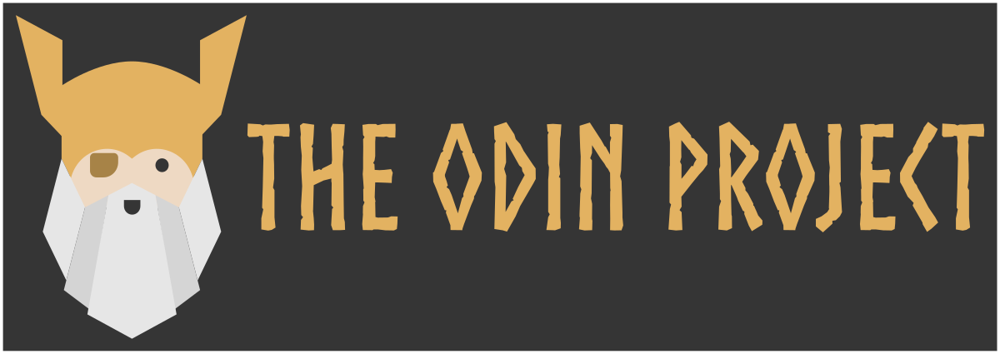

<h1 align="center">
  
</h1>

Curriculum Progress

---

  
  **This repository aims to create a comprehensive and interactive showcasing of my journey through The Odin Project curriculum.**

## 🚧 WIP 🚧

All projects were recently consolidated into this single repository from their original individual
repositories. (Here's the script I made to streamline this process
[migrate-repo.sh](https://gist.github.com/Gajdascz/df0fb1e98dd0e3d9687d982807d9dd5f)).

An interactive interface to explore the repository is in progress.

## License

All work contained in this repository is licensed under the [GNU GENERAL PUBLIC LICENSE](./LICENSE)
  &copy; 2024 Nolan Gajdascz [Github](https://www.github.com/gajdascz)
